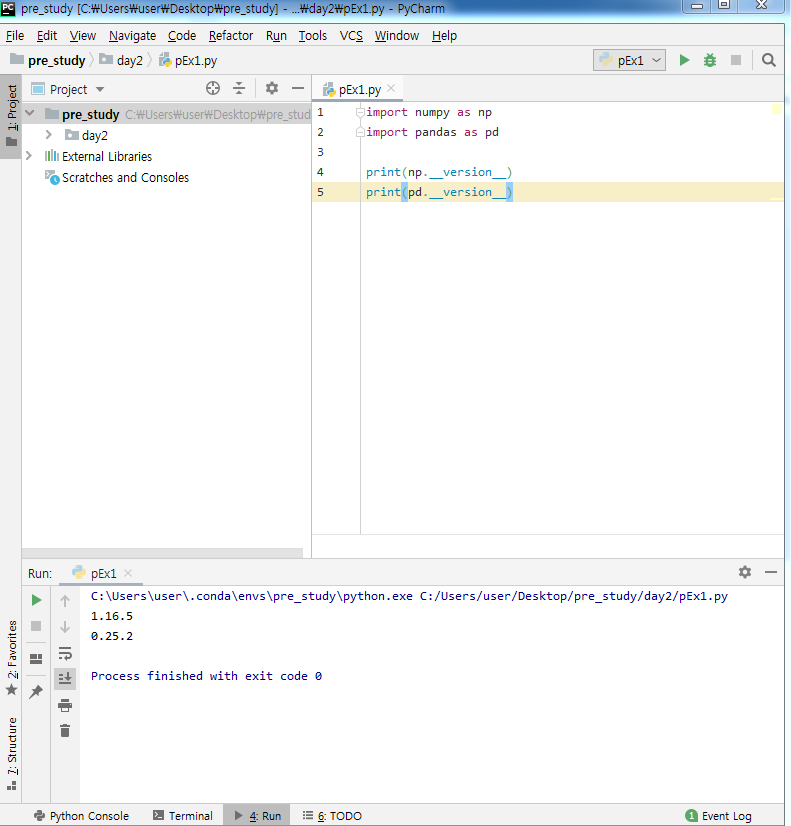
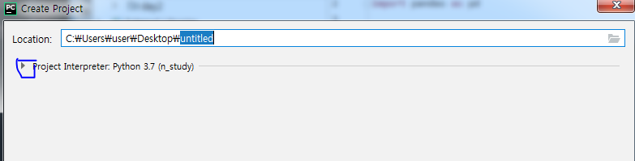
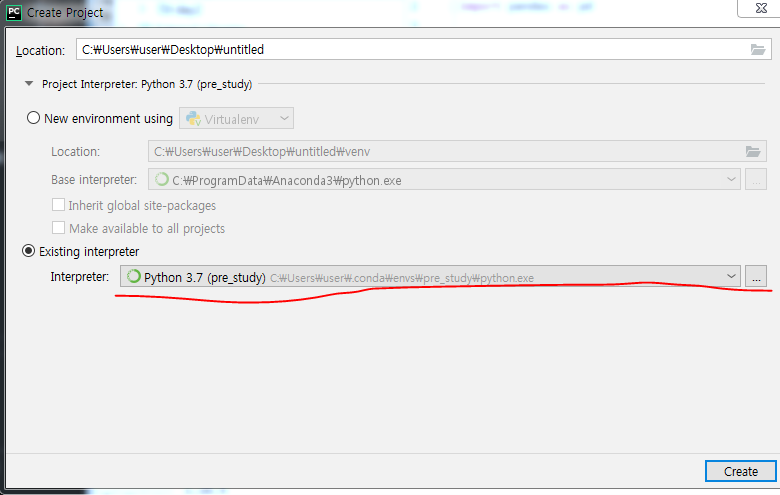

## Machine Learning(ML)

Python을 이용한 ML Pre Processing 강의를 정리한 POST입니다.

## PyCharm

### 프로젝트 생성 방법

1. File -> New Project
2. `more` 메뉴 클릭

3. 미리 설치한 `interpreter`를 선택

4. `create` 클릭

5. `File` -> `Python File`

6. 코드 작성 후 `run`을 하기 위해서 `Alt` + `Shift` + `F10`

#### Sample code

~~~python
result = []

# List를 생성하는 방법
for i in range(10) :
    result.append(i)
print(result)

# Compression 방식
result2 = [i  for i in range(10)]
print(result2)

result3 = []
for i in range(10) :
    if i % 2 == 0 :
        result3.append(i)
print(result3)

result4 = [i  for i in range(10) if i %2 ==0]
print(result4)

result5 =[]
# else 문이 사용할 경우 if else 문을 앞에서 선언해야 한다.
result5 = [i  if i %2 ==0 else 10 for i in range(10) ]
print(result5)
# [0, 10, 2, 10, 4, 10, 6, 10, 8, 10]

data1 = 'hello'
data2 = 'world'
result6 = [i+j for i in data1 for j in data2 if not (i==j)]
print(result6)

words = 'the quick brown for jumps over the lazy dog'.split()
print(words)

result7 = [[w.upper(), w.lower(), len(w) ] for w in words]
print(result7)
~~~

> Compression 방식을 사용하면 가독성이 떨어지지만 처리 속도가 빨라진다.

